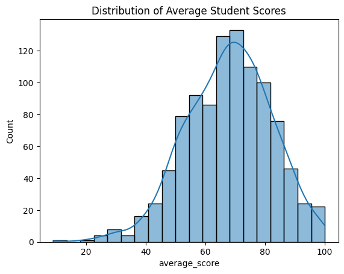
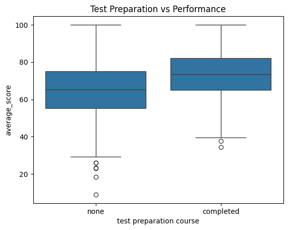
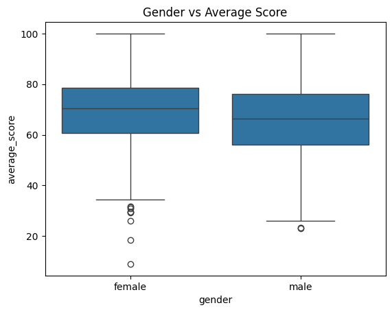

# Student Performance Analysis (EDA)

## Project Overview
This project performs Exploratory Data Analysis (EDA) on a real-world education dataset to understand factors affecting student academic performance.

## Dataset
- Source: Kaggle – Students Performance in Exams
- Records: 1000 students
- Features:
  - Gender
  - Parental level of education
  - Lunch type
  - Test preparation course
  - Math, Reading, Writing scores

## Tools & Technologies
- Python
- NumPy
- Pandas
- Matplotlib
- Seaborn
- Jupyter Notebook

## Analysis Performed
- Data understanding and cleaning
- Feature engineering (average score)
- Univariate analysis
- Bivariate and multivariate analysis
- Correlation analysis

## Key Insights
- Students who completed test preparation courses performed significantly better
- Reading and writing scores are highly correlated
- Female students showed slightly higher average performance
- Parental education level has an impact on student performance

## Visualizations
### Average Score Distribution


### Test Preparation vs Performance


### Gender vs Performance


## How to Run
```bash
python -m venv venv
venv\Scripts\activate
pip install -r requirements.txt
jupyter notebook
